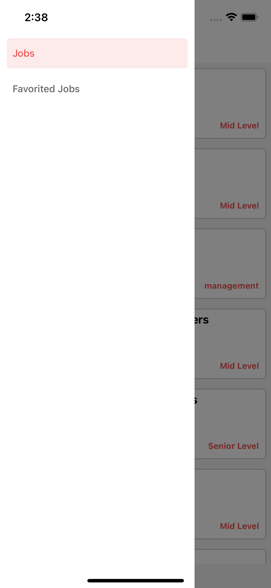

# CodeWork App

_Patika Bootcamp CodeWork._

# React Native

CodeWork

## Installation

Use npm to install all packages of package.json.

```bash
npm install
```

## Usage

```
# for Android
react-native run-android
```

```
# for iOS
react-native run-ios
## App Images





## Tools & Resources

- React-navigation
- Lottie
- React-Native-vector-icons
- axios
- React-native-config
- React-redux
```
